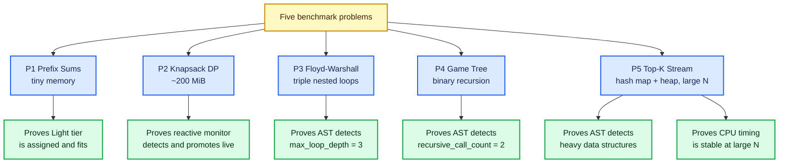

# Benchmark Problem Suite

The RAAS-OCJS benchmark suite consists of five authentic, high-stakes competitive programming problems modeled after real-world contest platforms (**Codeforces**, **ICPC**, **LeetCode Hard**, and **AtCoder DP Contest**).

Each problem is explicitly engineered to exercise a specific subsystem of the adaptive scheduler: AST loop detection, recursion branching factor, memory watermark breaching, or heavy container usage.

---

## Problem 1: Range Prefix Sums & Cumulative Balance

- **Contest Reference**: CSES Range Queries / Codeforces Div 2A
- **Algorithmic Category**: `Prefix Sums`
- **Time Complexity**: $O(N + Q)$
- **Space Complexity**: $O(N)$
- **Target Scheduling Evaluation**: **Light Tier / Zero Pressure**. Verifies baseline execution when resource demand is minimal ($< 10\text{ MB}$ RSS, zero watermark events).

### Problem Statement
Given an array of $N$ integers and $Q$ range queries $[L, R]$, compute the cumulative prefix sums to answer each query sum $\sum_{i=L}^{R} A[i]$ in $O(1)$ time.

### Test Cases
- **Case 1**: $N = 8$, $Q = 3$ queries: `[2..4, 5..6, 1..8]` $\rightarrow$ Output: `11\n2\n24\n`
- **Case 2**: $N = 6$, $Q = 2$ queries: `[1..3, 4..6]` $\rightarrow$ Output: `60\n150\n`

---

## Problem 2: 0-1 Knapsack Large State Space (2D Grid DP)

- **Contest Reference**: AtCoder Educational DP Contest / LeetCode Hard
- **Algorithmic Category**: `Dynamic Programming`
- **Time Complexity**: $O(N \times W)$
- **Space Complexity**: $O(N \times W)$ ($\approx 200\text{ MiB}$ physical RSS)
- **Target Scheduling Evaluation**: **Reactive / Hybrid Live Migration**.

### Problem Statement
Given $N$ items and a total knapsack capacity $W$, compute the optimal subset value using a large 2D state space table `DP[N][W]`. The state space table is dimensioned to allocate and touch ~200 MiB of RAM, deliberately crossing the ~179.2 MiB cgroup watermark (70% of 256 MiB, `LOW_MEM_HIGH_WATERMARK`).

### Behavior Under Test
1. The container launches in the Light tier with a 256 MiB hard limit and 179.2 MiB (70%) soft watermark.
2. During the DP execution, memory commitment exceeds 179.2 MiB.
3. The reactive monitor detects the event and issues `docker update --memory 0 --cpus 0`.
4. The container is promoted live to Uncapped at **~538 ms** without process interruption.

---

## Problem 3: All-Pairs Shortest Path (Floyd-Warshall Algorithm)

- **Contest Reference**: CSES Graph Algorithms (Shortest Routes II) / Codeforces 25C
- **Algorithmic Category**: `Graph / Floyd-Warshall`
- **Time Complexity**: $O(V^3)$
- **Space Complexity**: $O(V^2)$
- **Target Scheduling Evaluation**: **Predictive Loop Topology**.

### Problem Statement
Computes the shortest paths and path matrix counts between all pairs of vertices in a dense directed graph using the triply nested Floyd-Warshall algorithm:
$$D[i][j] = \min(D[i][j], D[i][k] + D[k][j])$$
Evaluates AST detection of `max_loop_depth = 3`, high arithmetic density, and 2D subscript operations.

### Test Cases
- **Case 1**: $V = 100$ vertices ($10,000$ edges) $\rightarrow$ Execution: ~240–300 ms pure CPU time.
- **Case 2**: $V = 120$ vertices ($14,400$ edges) $\rightarrow$ Execution: ~500–650 ms pure CPU time.

---

## Problem 4: Game Tree Search (Binary Branching Recursion)

- **Contest Reference**: LeetCode Hard (N-Queens / Sudoku Solver) / ICPC Backtracking
- **Algorithmic Category**: `Game Theory / Recursion`
- **Time Complexity**: $O(2^N)$
- **Space Complexity**: $O(N)$ Call Stack Depth
- **Target Scheduling Evaluation**: **Predictive Recursion Branching**.

### Problem Statement
Explores an exponential binary decision game tree with recursive self-calls per node ($k=2$). Designed to verify Tree-sitter's extraction of `is_recursive = true` and `recursive_call_count = 2`.

### Test Cases
- **Case 1**: Decision tree depth $N = 30$ (~$2^{30}$ recursive evaluations) $\rightarrow$ Expected: `832040`
- **Case 2**: Decision tree depth $N = 32$ (~$2^{32}$ recursive evaluations) $\rightarrow$ Expected: `2178309`

---

## Problem 5: Top-K Streaming Frequencies (Hash Map + Priority Queue)

- **Contest Reference**: LeetCode 347 / Codeforces 1353E
- **Algorithmic Category**: `Streaming / Heaps`
- **Time Complexity**: $O(N \log K)$
- **Space Complexity**: $O(N)$
- **Target Scheduling Evaluation**: **Predictive STL Detection & High-$N$ CFS Accounting**.

### Problem Statement
Processes a large data stream of integers to calculate the top-frequency items using standard hash maps (`unordered_map`, `defaultdict`, `HashMap`) and max-heaps / priority queues (`priority_queue`, `heapq`).

### Calibrated Input Scale
To eliminate sub-millisecond measurement noise and demonstrate stable scheduling metrics, the test cases are scaled via `generateFrequencyTestCases()`:
- **Case 1**: $N = 30,000$ space-separated integers in range $[0..199]$. Expected: `0 150\n`
- **Case 2**: $N = 50,000$ space-separated integers in range $[0..199]$. Expected: `0 250\n`

### Performance Metrics
- **C++**: ~55 ms CPU time, 6.6 MB peak RSS.
- **Python**: ~135–165 ms CPU time, 10.9 MB peak RSS.
- **Java**: ~340 ms CPU time, 71.3 MB peak RSS.
- **C**: ~65 ms CPU time, 34.8 MB peak RSS.
- **Timing Variance**: $\le \pm 4\%$ across consecutive runs.
